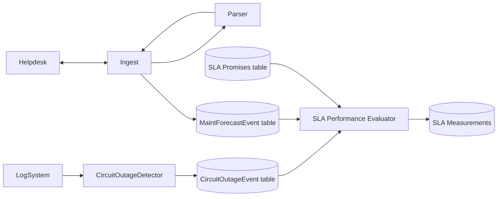
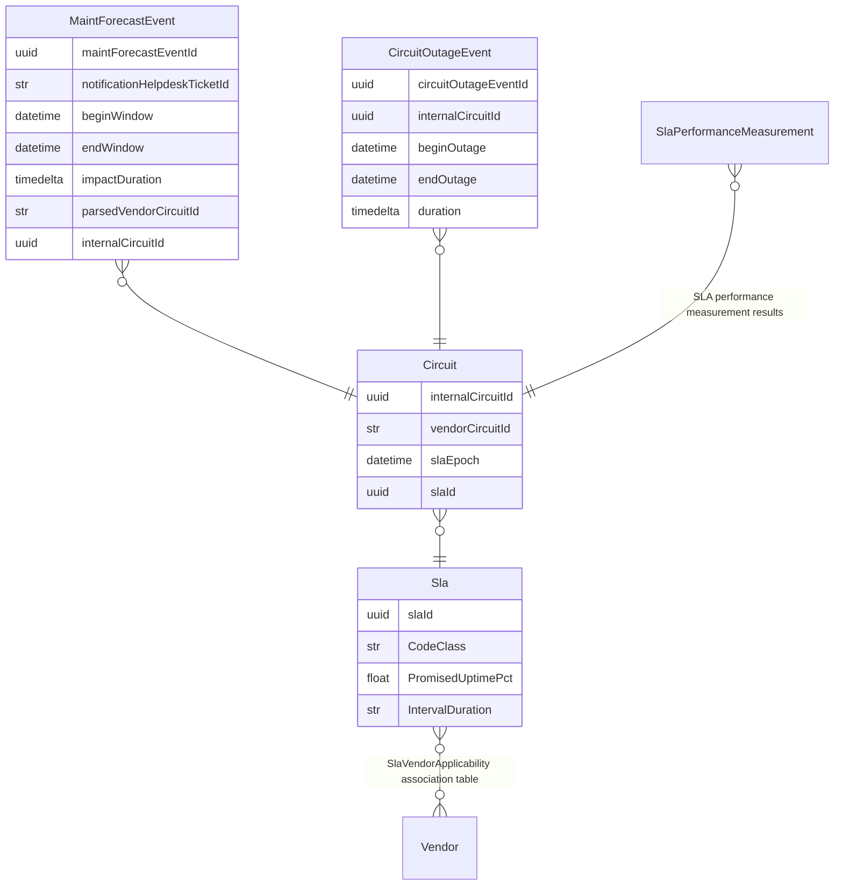
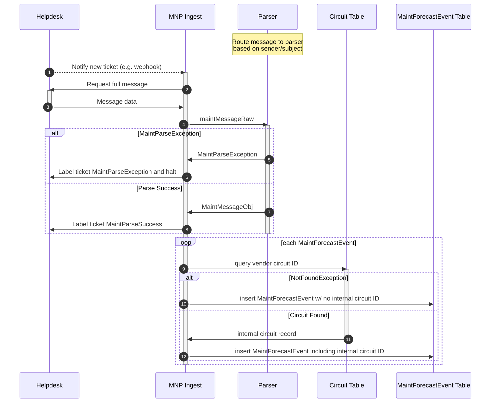
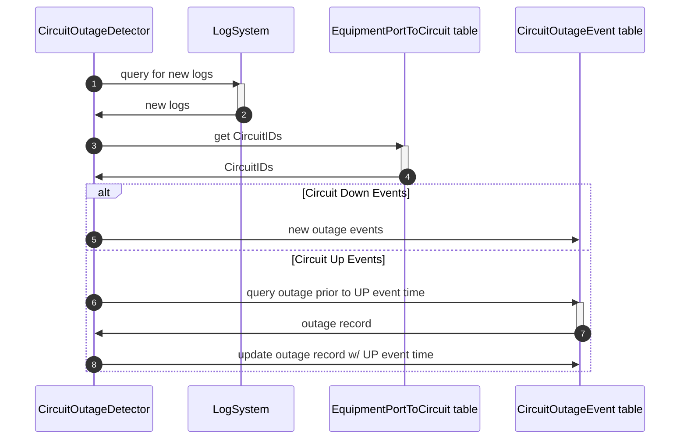
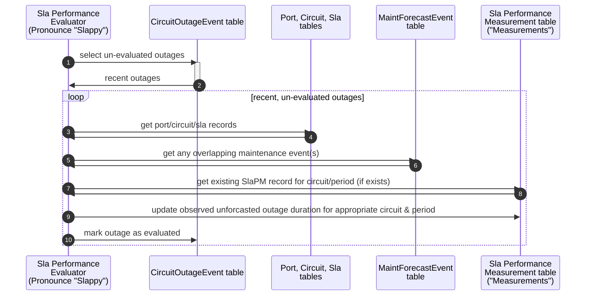

# Maintenance Notification Processor

⚠️ This is a toy project for a hiring process, not a fully-realized system.

### High Level Goals

Parse & process maintenance notification emails from service providers.  Match up observed outages with scheduled maintenance events.  Determine when outages breach relevant SLA.

* Receive maintenance notifications from API-fronted helpdesk/ticket system
  * There are 100+ providers so the formats will obviously differ
* Relate maintenance email to particular circuits / devices via a database
* Existing log system has data on device / circuit interruptions, also available via API
* SLA details for circuits are not databased but are present in documents (probably contract auxilary docs)

### Given the above:

- [ ] Architect a system to perform the requirements
- [ ] Specify processing pipeline & storage mechanisms
- [ ] Supply some code to parse maintenance emails (example of an email is available)

# Pipeline

A deliberately vague data pipeline is specified since not many details about the practical environment are known.

Some new database tables are defined:

* `CircuitOutageEvent` table populated by our new outage detector
* `MaintForecastEvent` table populated by our new maintenance email processor
* `SlaMeasurements` table populated by our new SLA performance evaluator
* `SlaPromises` table containing data about contractual SLAs expressed so software can understand it
  * `PromisedUptimePct` such as 99.9% uptime/availability
  * `IntervalDuration` describing the duration of Sla intervals, such as `calendarMonthFromFirst`, `calendarMonthFromTurnupDay`, `bankersMonth` (30d), and any others.
  * `CodeClass` giving the name of actual Python class implementing the Sla algorithm.  Maybe overkill, but if some SLAs are weird, it would be nice to sub-class for legibility.
  * Might need to add relationships for any diversity/protection arrangements among circuits -- understanding that "dark" services don't exactly have protection; but if you buy a ring and it's promised it won't have two cuts at once, you need a way to recognize what circuits belong to that ring
* `SlaVendorApplicability` table so newly-provisioned circuits can be associated with the right SLA without having to choose from a list of all SLAs in the system; UI can limit choices to those applicable to the relevant vendor

A few assumptions are made about existing data resources/tables

* Helpdesk system is assumed to have a labeling or workflow system so we can mark emails as having been processed successfully (or not).  It effectively functions as a dead letter file in case an email cannot be parsed and requires attention.
* Some kind of `Circuit` table containing vendor & internal circuit IDs
* Some kind of table mapping equipment ports to circuits for outage detection, in association with events from LogSystem



# Database ERD




# MaintNoticeProcessor

At this prototype/toy stage, only a message parser is implemented.  A CLI entry-point is provided for testing with emails contained in text files.

```
% pip install --editable ./
% mnp-parse --input-file test_emails/fiberprovider.com.txt
{
    "beginWindow": "2019-04-09 06:00:00+00:00",
    "endWindow": "2019-04-09 10:00:00+00:00",
    "impactSeconds": 10800,
    "objectType": "maintForecastEvent",
    "parsedVendorCircuitId": "IC-99999"
}
```

A sequence diagram of a more-realized implementation is below.



# CircuitOutageEvent detector

I haven't proposed many details for this component, as I think it depends a lot on the available data.

However, at a high level, if we're able to query something like ElasticSearch for circuit UP/DOWN events based on network ports & correlate those to circuits using a database table, that can produce output to a `CircuitOutageEvent` database table with the following essentials:

* `internalCircuitId`
* `beginDatetime`
* `endDatetime`

To be more general and thorough, additional consideration might be required for lit services which can have a lot more failure modes, and maybe situations like flapping or high path loss causing errors but not hard down events.  But for the scope of this toy project, I'll assume all outages have a clear begin & end, and no other complexity.




# SlaPerformanceEvaluator 

The SLA Performance Evaluator could be run as a batch job, as the results are not likely to be relevant until after the end of an SLA period (like a billing month) when a request for SLA credit could be made.

A sequence diagram, below, describes such an implementation, storing whether outages have been evaluated as a field in the `CircuitOutageEvent` table; and referencing other database tables to create & update an `SlaPerformanceMeasurements` table.



# Further

Further reports could be created from `SlaPerformanceMeasurements`, as well as other tables, to better understand provider reliability, time-to-repair, accuracy of maintenance forecasts, etc.

Combined with monetary data, the value of SLAs in terms of realized reimbursements could also be determined.

